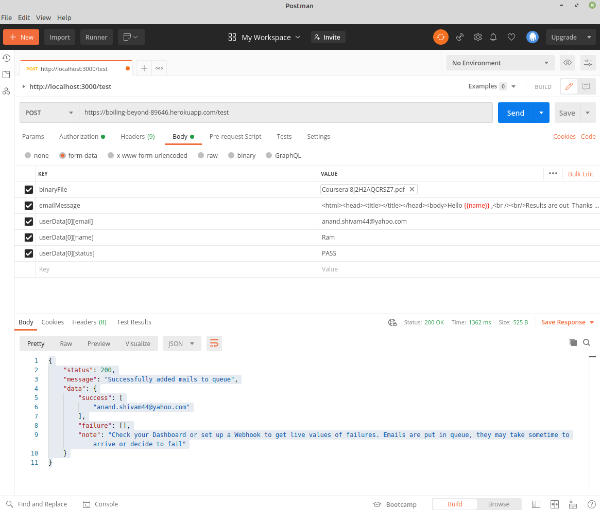

# Email Automation using SendGrid
Send Emails using Node, Express and SendGrid
### Prerequisite
 - node and node package manager
 - Postman

### How to setup in your localhost
 - Save your Api Key in your local environment
```bash
export API_KEY="Your custom API KEY from Sendgrid"
```
 - Install all dependencies listed in package.json
```bash
npm install
```
 - To start the endpoint use
```bash
npm start
```
or
```bash
node index.js
```
 - In the console check Port number
   Example
   ```bash
   server started on PORT : 5000
   ```
 - Open Postman and make a get request on http://localhost:5000 
If You you get a callback as "Hello World", your server has started successfully on localhost  

## How to Test the API
### Without attachment
To send an email to a person copy paste this json Tree. This is the simplest payload. Every field is mandatory. Replece ``` emailMessage ``` with your HTML Body and ``` email ``` with an email id you want to send an email.
###### Sample Input
```js
{
    "userData": [
        {
            "email": "YOUR_EMAIL@PROVIDER.com",
            "name": "Ram",
            "status": "PASS",
            "cc":[],
            "bcc":[]
        }
    ],
    "emailMessage": "<html><head><title></title></head><body>Hello {{name}} ,<br /><br/>Results are out<br /><br/><br /><br/>You are designated as {{status}}<br /><br/></body></html>"
}
```

###### Sample Output
```bash
{
    "status": 200,
    "message": "Successfully added mails to queue",
    "data": {
        "success": [
            "anand.shivam44@yahoo.com"
        ],
        "failure": [],
        "note": "Check your Dashboard or set up a Webhook to get live values of failures. Emails are put in queue, they may take sometime to arrive or decide to fail"
    }
}
```
###### Check Your MailBox </br>
Check your mailbox to see the email you have sent. Emails are put in queue by sendgrid, they may take sometime to arrive or decide to fail.

##### More complex Input JSON samples
```bash
{
    "userData": [
        {
            "email": "EMAIL_1@PROVIDER.COM",
            "name": "Ram",
            "status": "PASS",
            "cc":["EMAIL_2@PROVIDER.COM"],
            "bcc":[]
        },
        {
            "email": "EMAIL_1@PROVIDER.COM",
            "name": "Ram",
            "status": "PASS",
            "cc":["EMAIL_3@PROVIDER.COM","EMAIL_4@PROVIDER.COM"],
            "bcc":["EMAIL_5@PROVIDER.COM","EMAIL_6@PROVIDER.COM"]
        }
    ],
    "emailMessage": "<html><head><title></title></head><body>Hello {{name}} ,<br /><br/>Results are out<br /><br/><br /><br/>You are designated as {{status}} This is the raw body<br /><br/></body></html>"
}
```
### With attachment
Attachments can se sent in an API using form-data and binary data. In binary data method one attachment can be sent with no body. Here form-data is used.

The easiest way to test the API with attachment
 - Open Postman
 - Select POST as a request
 - Add url http://localhost:5000
 - Click on Body Tab
 - Click ``` form-data ```
 - Add key as ```binaryFile``` In the same horizontal line click on dropdown select ```File``` and choose the file you want to send
 - Now fill all other options in the sample image

Key | Value |
--- | --- |
binaryFile | [CHOOSE FILE]] |
emailMessage | <p>Sample HTML Body</p> |
userData[0][email] | EMAIL@PROVIDER.COM |
userData[0][name] | Ram |
userData[0][status] | PASS |



##### More complex sample imput
Key | Value |
--- | --- |
binaryFile | [CHOOSE FILE]] |
emailMessage | <p>Sample HTML Body</p> |
userData[0][email] | EMAIL1@PROVIDER.COM |
userData[0][name] | Ram |
userData[0][status] | PASS |
userData[0][cc] | EMAIL2@PROVIDER.COM |
userData[1][email] | EMAIL3@PROVIDER.COM |
userData[1][name] | Shyam |
userData[1][status] | FAIL |
userData[1][cc] | EMAIL4@PROVIDER.COM |
userData[1][cc] | EMAI5L@PROVIDER.COM |
userData[1][cc] | EMAIL6@PROVIDER.COM |
userData[1][bcc] | EMAIL7@PROVIDER.COM |
userData[1][bcc] | EMAIL8@PROVIDER.COM |


## How to work with TypeScript and Node
To compile your typescript file to javascript you must have type script installed. To install TypeScript
```bash
sudo npm install -g typescript
```
Compile TypeScript > JavaScript
```bash
tsc index.ts
```
Now Run the index.js using node
```bash
node index.ts
```